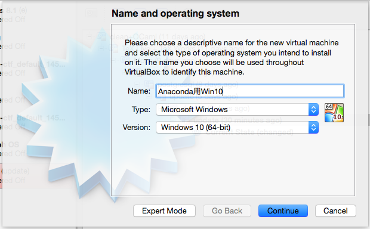
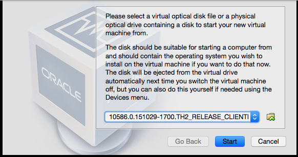
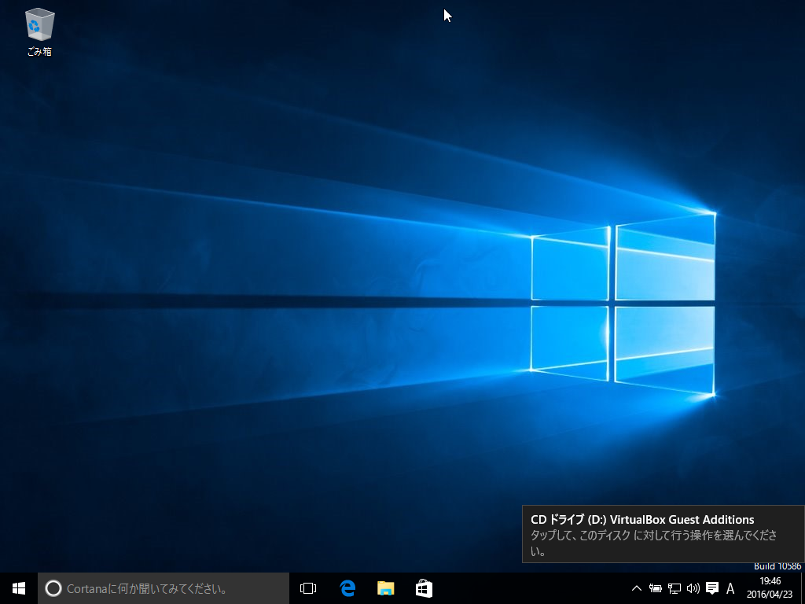
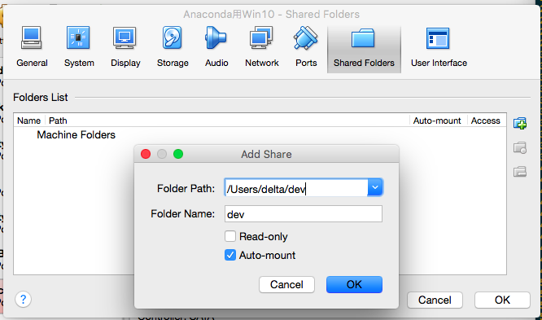
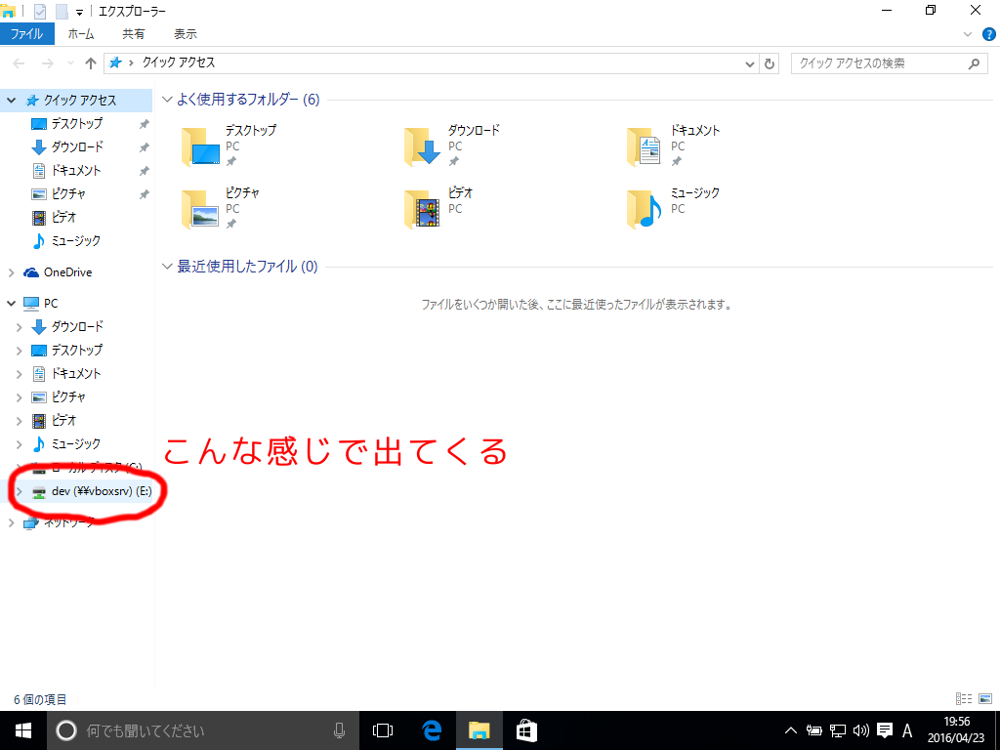

これはサークル用資料です。

# AnacondaをOSXで動かす方法

色々検討してみましたが、Windowsの仮想マシンでやるのが一番早いという結論に
達したので、手順をメモっておきます。

## 仮想マシンとは?

パソコンで動いているOS(この場合はOSX)の上で仮想化ソフトを利用し
別なOS(この場合はWindows)を動かしたもののことです。
パソコンの中でもう一つパソコンをシミュレートする感じです。

まずWindowsのインストールディスク(のようなもの)を入手した上で
仮想化ソフトをダウンロードし、設定をした上でAnacondaを仮想マシンの中のWindowsに
インストールします。

## Windows 10のISOを取得

[ここ](https://www.microsoft.com/ja-jp/evalcenter/evaluate-windows-10-enterprise)
からWindows 10の評価版をダウンロード。
`なんとかTH2_RELEASE_CLIENTENTERPRISEEVAL_OEMRET_X64FRE_JA-JP.ISO`
みたいなファイルが手に入るはず。
(マイクロソフトアカウントでのログインを要求される)

注) __LTSBではない方と64bitを選択(画像参照)__


## 仮想化ソフト(VirtualBox)のインストール

<small>
もしVMWare等別の仮想化ソフトを使いたいなら、この先は自分で設定して下さい。
</small>

[ここ](https://www.virtualbox.org/wiki/Downloads)の
`VirtualBox 5.0.18 for OS X hosts`をダウンロードし、インストール。

## Windowsのインストール

「New」を押し、適当な名前を入れた上で指示に従い仮想マシンを作成。

注) ここで「Version」が「Windows 10 (64-bit)」にすること



仮想マシンを起動すると



こういう画面が出るはずなので、先ほどダウンロードした.ISOファイルを選択。
その後、指示に従ってWindowsをインストール。

注) ドメインの参加に関する選択は、__Azure HDではない方__を選択。

## 共有フォルダの設定

OSXと仮想マシン内のWindowsでファイルのやり取りをするために
共有フォルダを設定します。仮想マシンを起動した状態で
「Views」-> 「Insert Guest Additions CD Image...」をクリックすると、



というような通知が出てくるので、それをクリックし
「VBoxWindowsAdditions.exeの実行」を選択。
指示に従ってインストール、再起動。

再起動したら、一旦シャットダウンし、
仮想マシンの設定(右クリック -> 「Settings...」)を開く。
「Shared Folder」タブをクリックしプラスをクリック、
OSX上の適当なフォルダを選択し、「Auto-mount」にチェックをつける。



仮想マシンを再び起動し、しばらくすると設定した共有フォルダがWindowsから見れる
ようになったことを確認。



## Anacondaのインストール

講習会でもらった`Anaconda3-4.0.0-Windows-x86_64.exe`を
共有フォルダの設定の時に選択したフォルダにコピーし、
Windowsの方で起動、指示に従ってインストール。

## OpenCLランタイムをインストール

[ここ](http://registrationcenter-download.intel.com/akdlm/irc_nas/9022/opencl_runtime_16.1_x64_setup.msi)
からダウンロード、インストール。

注) このランタイムはIntel製CPU専用なので、パソコンにAMD製のCPUが入っている
場合は自分で頑張ってください。

## 諸設定

講習会でもらった`pyopencl-2015.2.4-cp35-none-win_amd64.whl`を
共有フォルダにコピー。スタートメニューの「全てのアプリ」から
「Anaconda Prompt」を起動し、

```
pip install mako
chdir /d E:/
pip install pyopencl-2015.2.4-cp35-none-win_amd64.whl
```

を実行。

